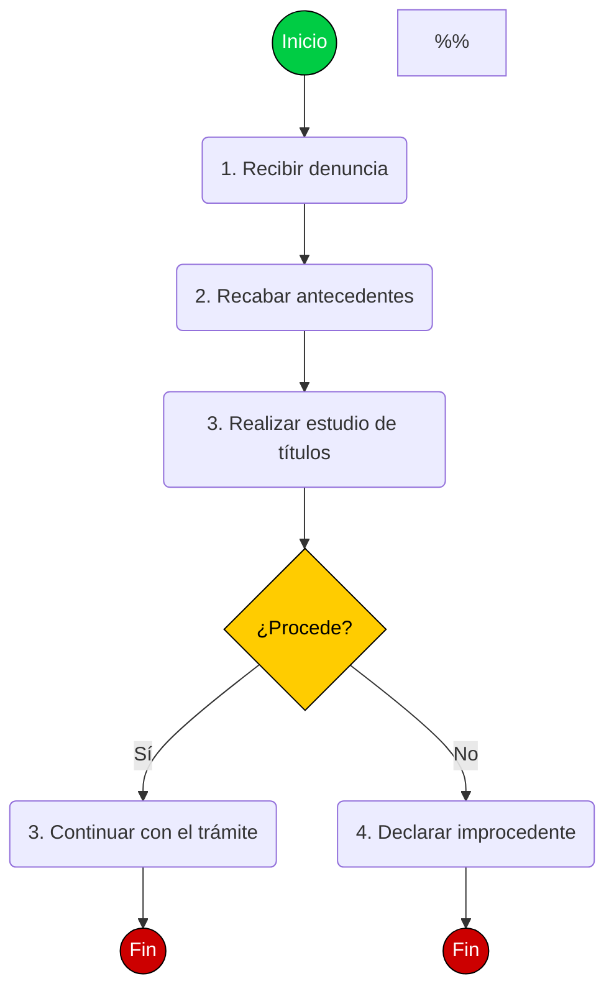

# Prueba 1

```mermaid
flowchart TD
    I((Inicio)) --> A(1. Recibir denuncia)
    A --> B(2. Recabar antecedentes)
    B --> G(3. Realizar estudio de títulos)
    G --> C{¿Procede?}
    C --> |Sí| D(3. Continuar con el trámite)
    C --> |No| E(4. Declarar improcedente)
    D --> F1((Fin))
    E --> F2((Fin))

    %% Colores de los nodos
    style I fill:#00cc44,stroke:#000,color:#fff
    style F1 fill:#cc0000,stroke:#000,color:#fff
    style F2 fill:#cc0000,stroke:#000,color:#fff
    style C fill:#ffcc00,stroke:#000,color:#000
    %%
```
